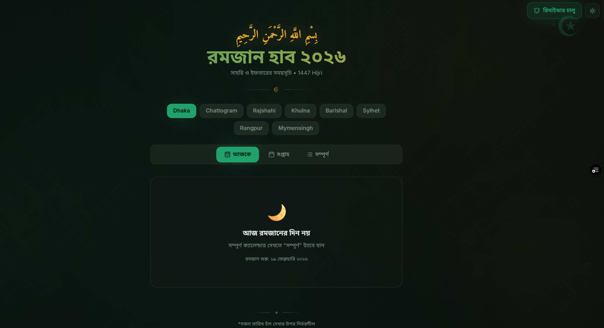
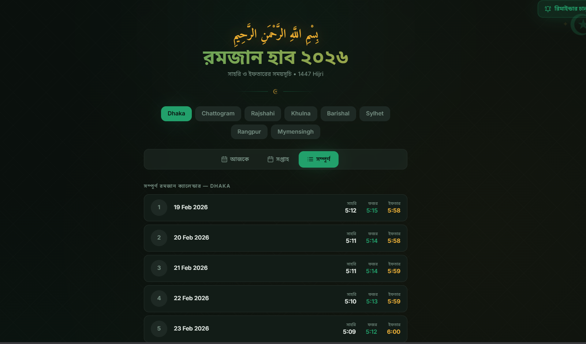

<p align="center">
  
</p>

<h1 align="center">🌙 Ramadan Hub 2026</h1>

<p align="center">
  <strong>A beautiful, mobile-first Progressive Web App for Ramadan Sehri & Iftar schedules across all 8 divisions of Bangladesh.</strong>
</p>

<p align="center">
  <a href="https://ramadanhub.shoaaib.site/">🔗 Live Website</a>
</p>

---

## 📸 Screenshots

### Home — Today's Schedule


### Full Week View


### Full Calendar View


---

## ✨ Features

-  **Division-wise Schedules** — Accurate Sehri, Fajr & Iftar times for all 8 divisions of Bangladesh (Dhaka, Chattogram, Rajshahi, Khulna, Barishal, Sylhet, Rangpur, Mymensingh)
-  **Three Views** — Today, This Week, and Full 30-day Ramadan calendar
-  **Live Countdown Timer** — Real-time countdown to the next Sehri or Iftar
-  **Push Notifications** — Get reminded before Sehri & Iftar automatically
-  **Installable PWA** — Install as a native app on Android, iOS, and desktop
-  **Dark & Light Mode** — Beautiful Islamic-themed UI with toggle support
-  **Islamic Decorations** — Crescent, stars, and ornamental design elements
-  **Offline Support** — Works without internet once installed
-  **Bengali Interface** — Fully localized in Bangla

---

## 🎯 Purpose

Ramadan Hub was built to provide a **simple, elegant, and accessible** way for Muslims in Bangladesh to check their daily Sehri and Iftar times during Ramadan 1447 Hijri (2026).

Instead of searching through newspapers or unreliable websites, users can:
- Instantly see today's schedule for their division
- Set up automatic reminders
- Install the app on their phone for quick access
- Browse the entire month's calendar at a glance

The goal is to make Ramadan planning effortless — **one tap, all the info you need**.

---

## 🛠️ Tech Stack

| Technology | Purpose |
|---|---|
| React 18 | UI Framework |
| TypeScript | Type Safety |
| Vite | Build Tool |
| Tailwind CSS | Styling |
| shadcn/ui | UI Components |
| vite-plugin-pwa | PWA & Service Worker |
| Lucide Icons | Iconography |

---

## 🚀 Getting Started

```bash
# Clone the repo
git clone https://github.com/ShoaibTaimur/ramadan-hub.git

# Navigate to project
cd ramadan-hub

# Install dependencies
npm install

# Start dev server
npm run dev
```

---

## 📄 License

This project is open source and available under the [MIT License](LICENSE).

---

<p align="center">
  Built with ❤️ by <a href="https://github.com/ShoaibTaimur">Shoaib Taimur</a>
</p>
